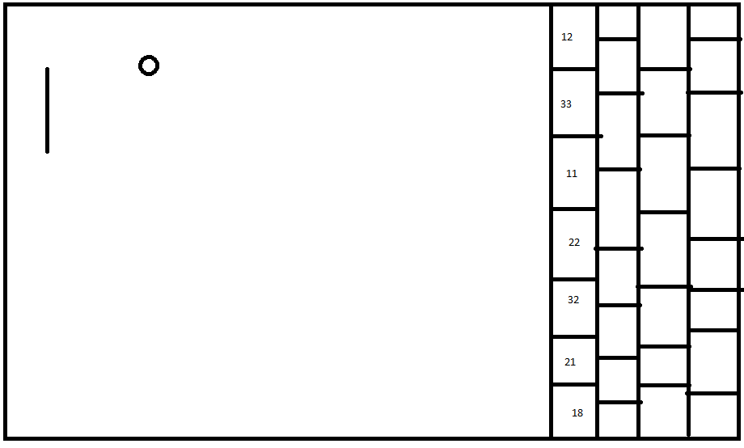
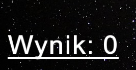
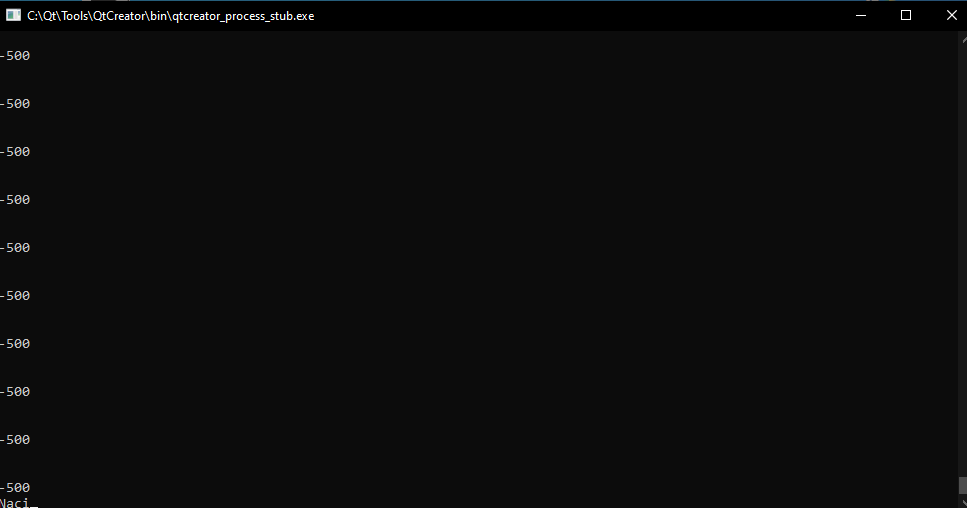
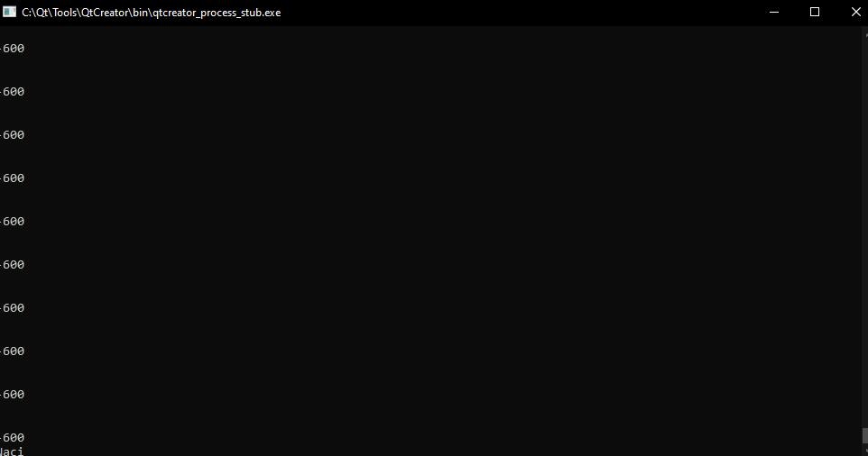
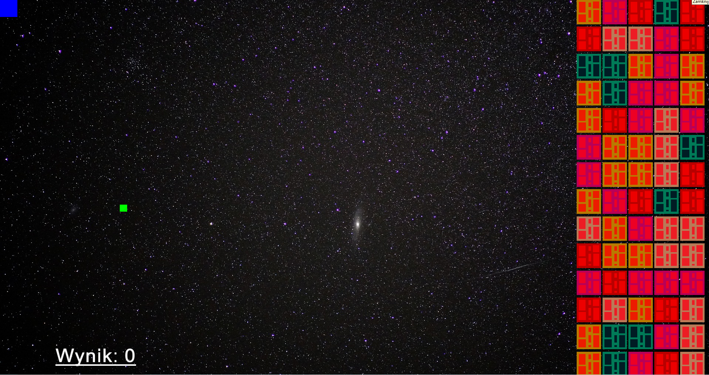

## Table_Tennis
AKTUALNE

Tytuł gry:Table Tennis

Makieta:

Fabuła: Jest jeden tryb, zrezygnowałem z tryby 1vs1, ponieważ nie do końca byłem usatysfakcjonowany rozgrywką. 
Tryb ściany jest głównym projektem gry. Ściana po każdym uderzeniu zmienia kolor. Kolory oznaczają poziom ściany:

-Żólta 1 hp,

-Magenta 2 hp;

-Biały 3 hp;

-Czerwony 4 hp;

-Cyjan 5hp.

Dodatkowo za każdy zniszcozny bloczek naliczane są punkty.

Licznik:

Przy zdobyciu odpowiedniej ilości punktów prędkość zwiększa 
się.

Prędkość początkowa:

Prędkość końcowa:

Gra jest 2D, jest inna, ponieważ nigdy takiej nie widziałem. Gra na celu miała pokazać opanowane umiejętności z zajęć. 
Dodatkowo moim założeniem było zrobić coś trudniejszego niż czasochłonnego i powtarzalnego(bardzo dużo takich ping pongów 
już istnieje.

Wyglad gry:

